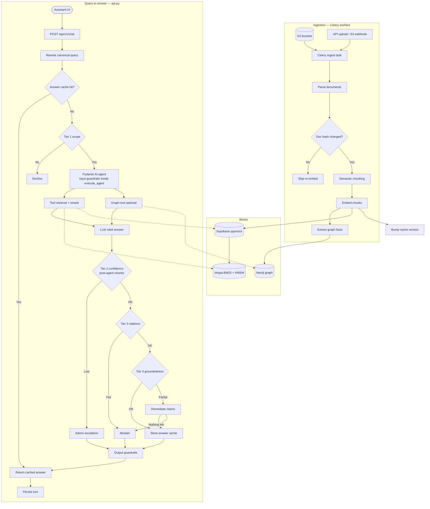
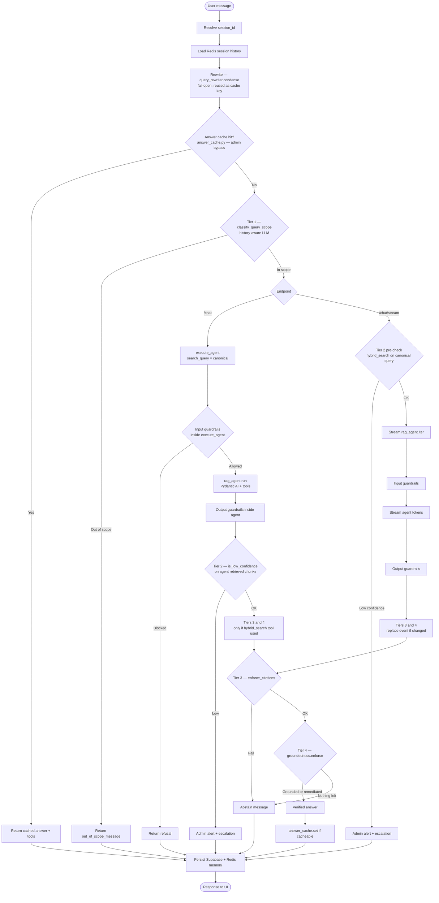
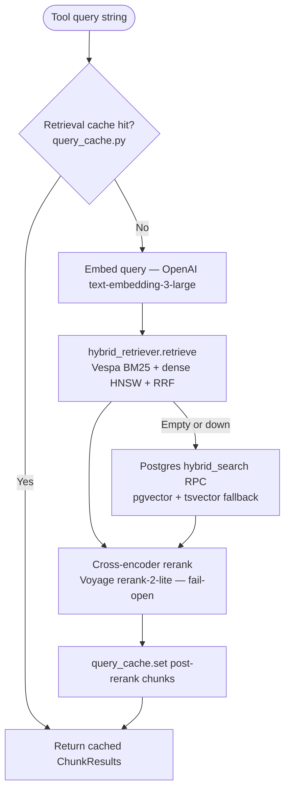
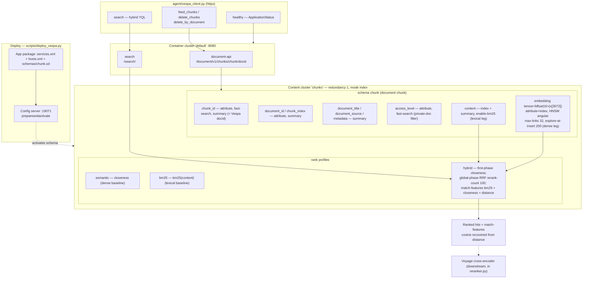
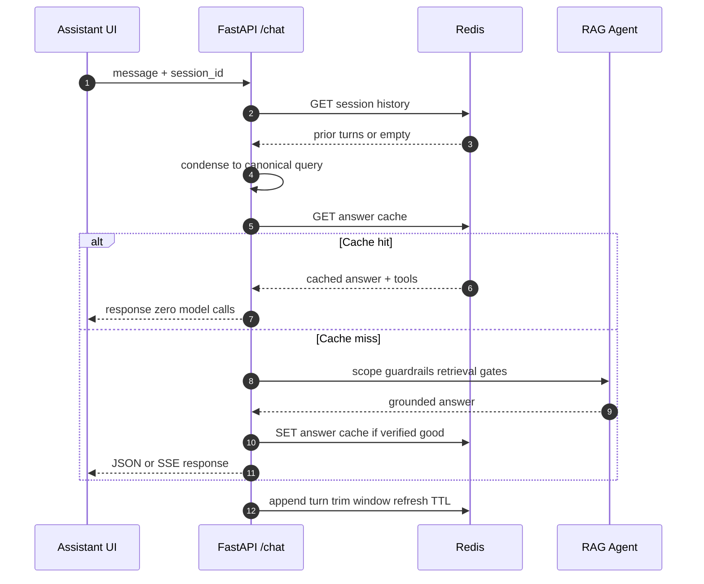
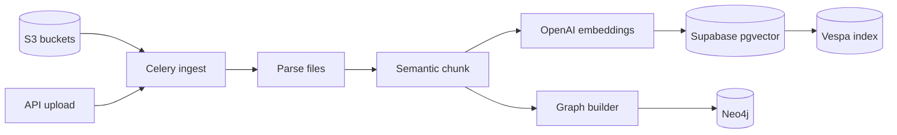
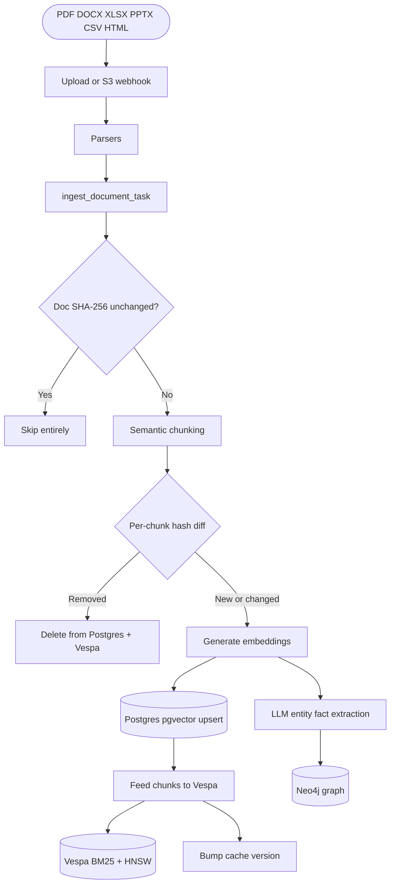
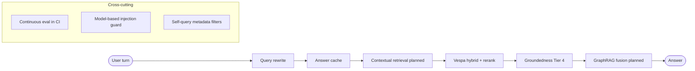

# Builtpulse Real Estate RAG — Enterprise Backend Services


The **Builtpulse Real Estate Assistant** backend is a state-of-the-art, enterprise-grade AI engine designed to assist property buyers, sellers, and agents. Powered by **Pydantic AI** and **FastAPI**, it runs a **three-stage retrieval pipeline**: a **Vespa** hybrid engine that fuses true **BM25** lexical search and **dense HNSW** vector search with **Reciprocal Rank Fusion (RRF)** in a single query, a **cross-encoder reranker** (Voyage) precision stage, and a **Neo4j Knowledge Graph** for structured entity/fact lookups. **Supabase pgvector** is the durable source of truth and an automatic fallback if Vespa is unreachable.

Answers pass through **four safety tiers**—scope classification, a cosine-similarity confidence gate, citation enforcement, and a groundedness judge with claim-level remediation—so the assistant abstains or strips unsupported claims rather than hallucinating. The system features real-time asynchronous background pipelines running on **Celery + Redis**, strict guardrails (prompt-injection filters and PII redaction), Redis-backed session memory, and two cache layers (turn-level answer cache + retrieval cache). Users and agents test the assistant via the web **Assistant** chat UI.

---

## Architectural blueprints

### 0. End-to-end overview

Documents are ingested into **Postgres (pgvector)**, **Vespa** (primary retrieval), and **Neo4j**. Each chat turn rewrites the query, checks caches, runs the Pydantic AI agent (which calls retrieval tools), then applies four post-generation safety tiers.



> **Stream note:** `POST /api/v1/chat/stream` runs **Tier 2 as a pre-check** on `canonical_query` *before* the agent streams tokens. Non-streaming `/chat` runs Tier 2 **after** the agent, on chunks the agent actually retrieved.

---

### 1. Web chat RAG flow

Entry point: **Assistant** UI (`/dashboard/chat`) → `POST /api/v1/chat` or `/chat/stream`.

#### 1a. HTTP orchestration (`agent/api.py`)

Both paths share the same preamble; they diverge on confidence gating and streaming.



#### 1b. Retrieval sub-pipeline (`tools.hybrid_search_tool`)

Called by the agent's `search_documents` tool (and by the stream Tier 2 pre-check). This is the three-stage recall + precision stack.



#### 1c. Agent tools (`agent/agent.py`)

| Tool | Backing function | Purpose |
|------|------------------|---------|
| `search_documents` | `hybrid_search_tool` | Hybrid retrieval + rerank; populates `deps.retrieved_chunks` |
| `search_knowledge_graph_facts` | `graph_search_tool` | Neo4j `factIndex` lookup; populates `deps.graph_facts` |
| `list_available_documents` | `list_documents_tool` | Browse indexed document titles |

The agent receives a **dynamic system prompt** from `settings_store` plus a **static citation contract** (`[n]` inline citations). Post-generation, `citations.enforce` and `groundedness.enforce` validate the answer against the chunks retrieved **this turn**.

#### 1d. Inside Vespa — the deployed application package

Vespa is the **primary** retrieval engine. The diagram below shows every Vespa component we actually use: the deploy path (`scripts/deploy_vespa.py` → config server), the **container** cluster (feed + query APIs), the **content** cluster (the `chunk` document store), the `chunk` **schema** (fields, indexes, HNSW), and the three **rank profiles**. The Python client (`agent/vespa_client.py`) talks only to the container endpoints on `:8080`.



**Query mechanics (`vespa_client.search`):** the YQL issues an `OR` of `nearestNeighbor(embedding, q)` (HNSW, `targetHits` ≥ 100) and `userInput(@userquery)` (BM25), so both legs contribute candidates; the `hybrid` profile fuses them with **Reciprocal Rank Fusion** in `global-phase`. Anonymous callers get an `access_level contains "public"` clause appended; authenticated callers are unfiltered. True cosine is recovered from the `distance(field, embedding)` match-feature for the Tier 2 confidence gate.

#### Pipeline stages

| Stage | Module | What it does |
|-------|--------|--------------|
| **Query rewrite** | `query_rewriter.py` | Condenses follow-ups into one canonical query; reused for answer cache, scope, and retrieval. Fail-open. |
| **Answer cache** | `answer_cache.py` | Turn-level Redis cache on canonical query + access scope. Hit skips all model calls. Admin bypass; ingest-invalidated via shared cache version. |
| **Retrieval cache** | `query_cache.py` | Caches post-rerank chunk lists keyed on normalized query + scope + limit. Invalidated on ingest. |
| **Scope — Tier 1** | `guardrails.classify_query_scope` | History-aware LLM classifier; runs **before** the agent. Toggle via `enforce_scope` in settings. |
| **Input guardrails** | `guardrails.check_input` | Inside `execute_agent` / stream path: injection, abuse, length limits. Fail-closed. |
| **Agent loop** | `agent.py` + Pydantic AI | LLM selects tools, generates answer with `[n]` citation contract. |
| **Retrieval** | `tools.py` → `retriever.py`, `vespa_client.py`, `reranker.py` | Stage 0 cache → embed → Vespa hybrid (Postgres fallback) → Voyage rerank. |
| **Graph lookup** | `graph_utils.py` | Optional Neo4j full-text fact search via separate tool. |
| **Confidence — Tier 2** | `tools.is_low_confidence` | Top pgvector cosine `< 0.25` → escalate. **Non-stream:** post-agent on tool chunks. **Stream:** pre-check on canonical query before agent runs. |
| **Citations — Tier 3** | `citations.py` | Regex check: fabricated `[n]`, uncited substantive answers → abstain. Only when `selected_retrieval_tool == hybrid_search`. |
| **Groundedness — Tier 4** | `groundedness.py` | LLM judge: cited chunks must entail claims. Remediates by stripping unsupported claims; abstains if nothing survives. |
| **Output guardrails** | `guardrails.apply_output_guardrails` | PII redaction + prompt-leak scrub (inside agent, before Tier 3/4 on stream). |
| **Logging** | `db_utils`, `session_memory` | Supabase message log + Redis sliding-window history. |

#### Alternate path: `conversation.run_agent_turn`

Used by `scripts/eval_rag.py` (not the HTTP chat UI). Same rewrite + answer cache + agent, but **no Tier 1 scope classifier**, Tier 2 returns `ABSTAIN_MESSAGE` (no admin Celery alert), and gates live inside `conversation.py` instead of `api.py`.

---

### 2. Session memory and cache lifecycle

Redis holds **session history**, the **answer cache**, and the **retrieval cache**. A cache hit returns with zero model calls.



---

### 3. Document ingestion pipeline

Files arrive via API upload or S3 webhook; Celery workers parse, chunk, embed, and index into Postgres, Vespa, and Neo4j.



Detailed ingest with content-hash dedup:



---

## Hardening roadmap

The core pipeline — Vespa hybrid recall, cross-encoder rerank, Postgres fallback, and fail-open error handling — is in production. The table below tracks additive layers that improve accuracy, cost, and robustness.

| # | Enhancement | Status | Why it makes the RAG stronger | Where it lives |
|---|-------------|--------|-------------------------------|----------------|
| 1 | **Conversational query rewriting** | Done | Follow-ups like *"and for masters?"* retrieved poorly; now condensed once to a canonical query reused for cache, scope, and retrieval. | `agent/query_rewriter.py` → `api.chat` / `chat_stream` + `conversation.py` |
| 2 | **Turn-level answer cache** | Done | Memoizes the whole turn (answer + tools) keyed on the canonical query, so repeats skip scope, agent, retrieval, and judge (~15s → ~1.5s). Only verified-good answers cached; admin bypass; ingest-invalidated. Retrieval cache (`query_cache`) is a second tier. | `agent/answer_cache.py` + `agent/query_cache.py` → both chat paths |
| 3 | **Contextual retrieval** | Planned | Chunks lose surrounding context once split, hurting recall on terse chunks. Prepend a short doc/section summary to each chunk before embedding (Anthropic contextual-retrieval pattern). | `ingestion/chunker.py` + `embedder.py` |
| 4 | **Groundedness check + remediation (Tier 4)** | Done | LLM judge confirms the cited chunk *entails* each claim; strips only unsupported claims and keeps the grounded remainder, abstaining only when nothing survives. | `agent/groundedness.py` → `api.chat`, `chat_stream`, and `conversation.py` |
| 5 | **GraphRAG fusion** | Planned | `search_documents` and `search_knowledge_graph_facts` are independent tools the model may not combine. Fuse graph facts + vector chunks into one ranked context for multi-hop questions. | `tools.py` / `retriever.py` |
| 6 | **Continuous eval in CI** | Planned | `scripts/eval_rag.py` exists but runs ad-hoc. Promote a fixed golden Q→chunk set into CI tracking recall@k, MRR, and faithfulness to catch regressions on every change. | CI workflow + `scripts/eval_rag.py` |
| 7 | **Model-based injection guard** | Planned | `guardrails._INJECTION_RE` is regex-only and bypassable by paraphrase. Layer a small prompt-injection classifier over the regex fast-path. | `agent/guardrails.py` |
| 8 | **Self-query metadata filters** | Planned | Retrieval only filters on `access_level`. Let the agent emit structured filters (date / doc-type / department) into Vespa YQL for precise scoping. | `vespa_client.search` + tool schema |
| 9 | **Expanded PII + rate limiting** | Planned | PII redaction covers CNIC/card/key/JWT only; add email/phone. Add per-session/user rate limiting to blunt abuse and cost spikes. | `guardrails.redact_pii` + API middleware |
| 10 | **Vespa-native reranking** | Planned | Voyage rerank adds a network hop per query. Move to a Vespa global-phase ONNX cross-encoder to rerank in-engine. | `vespa/schemas/chunk.sd` global-phase |



> None of these change the public API or break fail-open guarantees — each is an additive, independently shippable layer.

### Scaling to ~100M documents

Scale is a **retrieval-engine** concern, independent of the agent/orchestration
layer (LangGraph, Pydantic AI, etc. have no bearing on it):

* **Vespa** is the component that scales — it's content-addressable and shards
  horizontally. 100M chunks × 3072-d `bfloat16` HNSW ≈ a multi-node content
  cluster; grow `<nodes>` in `services.xml` and Vespa redistributes. Keep the
  reranker's candidate pool bounded (≤100) so per-query cost stays flat as the
  corpus grows.
* **Postgres/pgvector** stays the durable source of truth and the rebuild source
  for Vespa (`scripts/backfill_vespa.py`) — it is *not* on the hot query path at
  scale, so its index size doesn't gate query latency.
* **Cost at scale** is dominated by embeddings (ingest, one-time per chunk) and
  per-turn LLM calls (scope + rewrite + agent + groundedness). The retrieval
  cache blunts repeat-query cost; set `GROUNDEDNESS_CHECK_ENABLED` per your
  hallucination-vs-cost tolerance — it is the largest per-turn add.

---

## 📚 References & Developer Documentation
To deep-dive into endpoints testing strategies or to check the QA test matrices, refer to our comprehensive internal documentation:
* 📄 **[API Testing Guide](apitesting.md)**: Detailed step-by-step specifications of all REST operations, Celery hooks, auth handshakes, and postman testing guidelines.
* 📋 **[QA Test Cases Log](testcases.md)**: Fully granular testing matrices, expected assertions, input/output boundary cases, and performance criteria log.

---

## 🛠️ Ingestion & Setup

### Service Map
* `api`: FastAPI application, serving all routes under `/api/v1/*` (port `8058`).
* `worker`: Celery worker performing document ingestion and background alerts.
* `beat`: Celery scheduler driving periodic 15-minute S3 synchronizations.
* `redis`: High-speed message broker, Celery backend, session memory, and endpoint/avatar cache store.

---

### 🚀 Running with Docker (Recommended)

1. Set up configurations:
   ```bash
   cp .env.example .env
   ```
2. Build and run all services:
   ```bash
   docker compose up --build
   ```
3. Access API Documentation at [http://localhost:8058/api/docs](http://localhost:8058/api/docs).

---

### 💻 Local (Non-Containerized) Setup

Ensure **PostgreSQL**, **Neo4j**, and **Redis** servers are running locally.

1. Initialize a Python virtual environment:
   ```bash
   python -m venv .venv
   source .venv/bin/activate
   ```
2. Install dependencies:
   ```bash
   pip install -r requirements.txt
   ```
3. Run the services across separate terminals:
   * **Terminal 1 (API)**:
     ```bash
     python -m uvicorn agent.api:app --reload --port 8058
     ```
   * **Terminal 2 (Celery Worker)**:
     ```bash
     celery -A worker.celery_app:celery_app worker -Q ingestion --loglevel=info
     ```
   * **Terminal 3 (Celery Scheduler)**:
     ```bash
     celery -A worker.celery_app:celery_app beat --loglevel=info
     ```

---

## 🧪 Testing Suite
Execute the testing framework using a clean container build:
```bash
docker run --rm -v "$(pwd)":/app -w /app builtpulse-backend:latest python -m pytest -q
```
