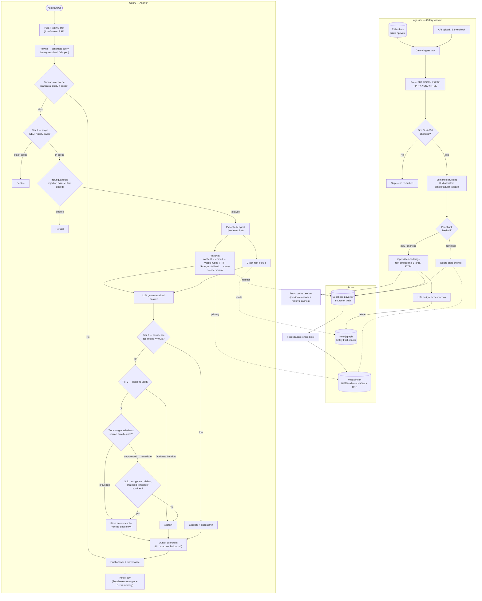
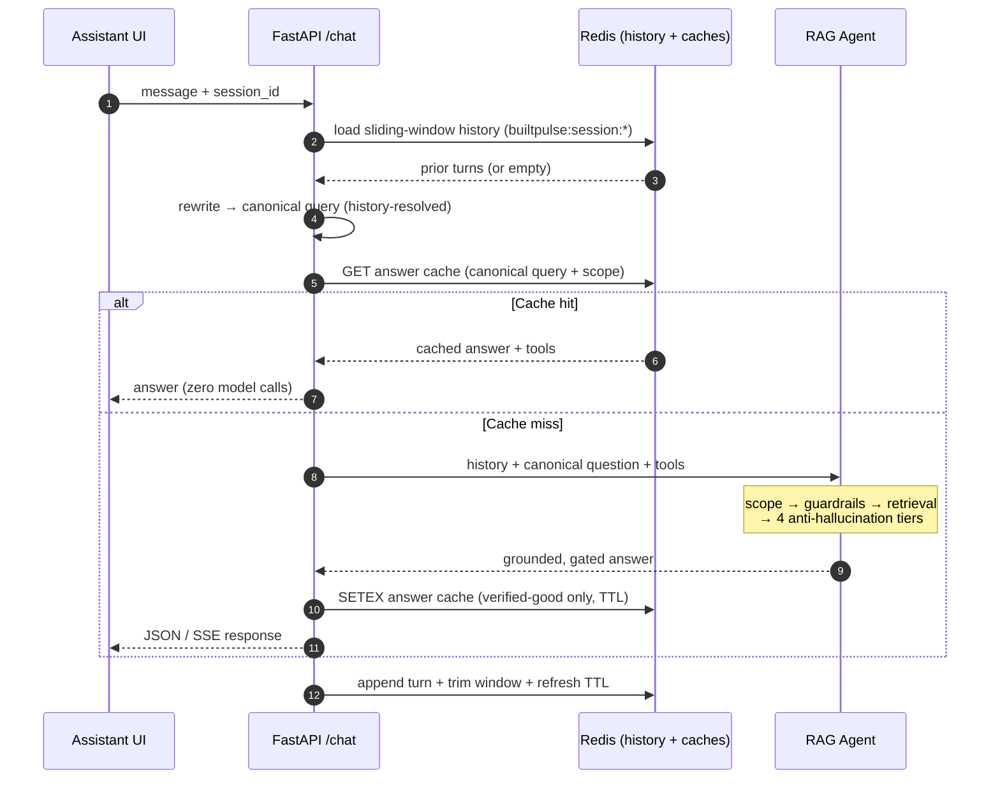
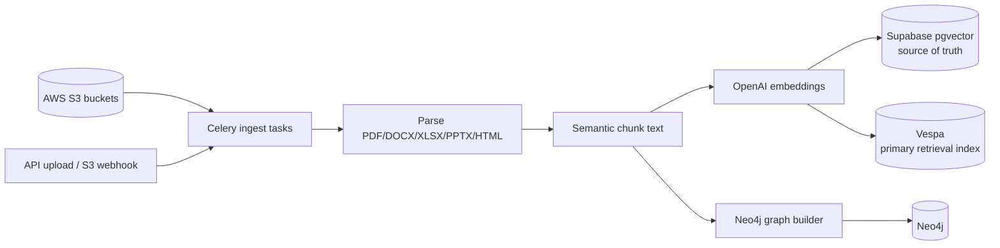
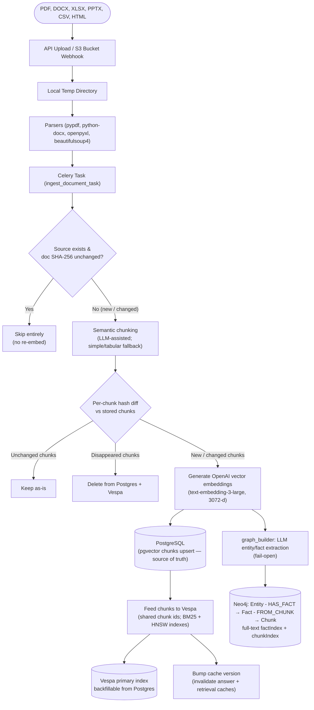
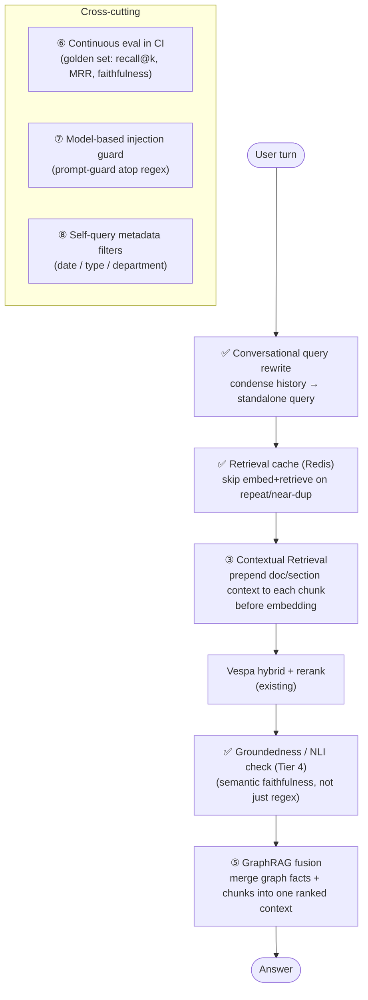

# Builtpulse Real Estate RAG — Enterprise Backend Services


The **Builtpulse Real Estate Assistant** backend is a state-of-the-art, enterprise-grade AI engine designed to assist property buyers, sellers, and agents. Powered by **Pydantic AI** and **FastAPI**, it runs a **three-stage retrieval pipeline**: a **Vespa** hybrid engine that fuses true **BM25** lexical search and **dense HNSW** vector search with **Reciprocal Rank Fusion (RRF)** in a single query, a **cross-encoder reranker** (Voyage) precision stage, and a **Neo4j Knowledge Graph** for structured entity/fact lookups. **Supabase pgvector** is the durable source of truth and an automatic fallback if Vespa is unreachable.

Answers pass through **three safety tiers**—a scope classifier, a cosine-similarity confidence gate, and post-generation citation enforcement—so the assistant abstains rather than hallucinates. The system features real-time asynchronous background pipelines running on **Celery + Redis**, strict guardrails (prompt-injection filters and CNIC/PII redaction), and robust connection caching. Users and agents test the agent via the web **Assistant** chat UI.

---

## 🏗️ Architectural Blueprints

### 0. End-to-End Architecture (Ingestion → Answer)
The complete pipeline in one view: documents are ingested, deduplicated, embedded
and indexed into three stores; queries then rewrite, cache, retrieve, fuse, and
pass through four anti-hallucination tiers before answering. The numbered sections
below break each half down in detail.



---

### 1. Web Chat RAG Flow
Users and agents test the agent via the **Assistant** UI (`/dashboard/chat`), which calls `POST /api/v1/chat` (or `/chat/stream` for SSE). The pipeline retrieves and fuses context from hybrid document search and the Neo4j knowledge graph before generating a grounded answer.

```mermaid
graph TD
    UI([Assistant UI<br/>/dashboard/chat]) --> API["POST /api/v1/chat<br/>(or /chat/stream SSE)"]
    API --> Session["Resolve session_id<br/>(Redis / in-process memory)"]

    Session --> Canon["Conversational query rewrite<br/>condense history + turn → canonical query<br/>(fail-open)"]
    Canon --> ACache{"Turn-level answer cache<br/>(Redis; canonical query + scope)"}
    ACache -->|Hit| CacheOut["Return cached answer + tools<br/>(zero model calls; admin bypass)"]
    ACache -->|Miss| Scope{"Tier 1 — Scope classifier<br/>(LLM, history-aware)"}
    Scope -->|Out of scope| Refuse["Return out_of_scope_message<br/>(from app_settings)"]
    Scope -->|In scope| InputG{"Input guardrails<br/>(length / injection / abuse)<br/>fail-closed"}

    InputG -->|Blocked| Blocked["Return refusal<br/>(no tools called)"]
    InputG -->|Allowed| Memory[(Redis session memory<br/>sliding-window history)]

    Memory --> Prompt["Build prompt<br/>history + canonical question"]
    Prompt --> Agent["Pydantic AI RAG Agent<br/>(OpenAI GPT-4o-mini / GPT-4o)"]

    Agent --> Tools{"Agent selects tools"}
    Tools --> DocTool["search_documents"]
    Tools --> GraphTool["search_knowledge_graph_facts"]
    Tools --> ListTool["list_available_documents"]

    subgraph Retrieval["Three-stage retrieval (search_documents)"]
        direction TB
        DocTool --> Cache{"Stage 0 — retrieval cache<br/>(Redis; normalized query + scope)"}
        Cache -->|Hit| Context
        Cache -->|Miss| Embed["1 - Embed query<br/>(text-embedding-3-large, 3072-d)"]
        Embed --> Vespa["2 - Vespa hybrid recall<br/>BM25 + dense HNSW → RRF<br/>(widened candidate pool)"]
        Vespa -.->|Vespa down / empty| PGFallback["Postgres hybrid_search RPC<br/>(pgvector + tsvector fallback)"]
        Vespa --> Rerank["3 - Cross-encoder rerank<br/>(Voyage rerank-2-lite, fail-open)<br/>→ top-k by true relevance"]
        PGFallback --> Rerank
        Rerank --> Store["cache result (TTL; ingest-invalidated)"]
    end

    GraphTool --> Neo4j["Neo4j full-text factIndex<br/>(entity / fact lookup)"]

    Store --> Context["Retrieved chunks + graph facts<br/>(stored in AgentDependencies)"]
    Neo4j --> Context

    Context --> LLM["LLM generates grounded answer<br/>(inline [n] citation contract)"]

    LLM --> Conf{"Tier 2 — Confidence gate<br/>top cosine >= 0.25?"}
    Conf -->|Low confidence| Alert["Celery: notify_admin_weak_context_task"]
    Alert --> Escalate["Return support-escalation message"]
    Conf -->|High confidence| Cite{"Tier 3 — Citation enforcement<br/>fabricated / uncited claim?"}
    Cite -->|Fails| Abstain["Swap for ABSTAIN message"]
    Cite -->|Passes| Ground{"Tier 4 — Groundedness judge<br/>do cited chunks ENTAIL every claim?"}
    Ground -->|Grounded| Store2["Cache verified answer<br/>(only good answers)"]
    Ground -->|"Ungrounded → remediate"| Remed{"Strip unsupported claims;<br/>grounded remainder survives?"}
    Remed -->|Yes| Store2
    Remed -->|No| Abstain
    Store2 --> OutG["Output guardrails<br/>(prompt-leak scrub, PII redaction)"]
    Abstain --> OutG

    OutG --> Answer["Final answer + provenance"]

    Answer --> Log["Persist turn + provenance<br/>(Supabase messages + Redis memory)"]
    CacheOut --> Log
    Escalate --> Log
    Refuse --> Log
    Blocked --> Log

    Log --> UI
```



| Stage | What it does |
|--------|----------------|
| **Query rewrite** | Condenses multi-turn follow-ups into one canonical, self-contained query — reused for the cache key, scope check, and retrieval (fail-open) |
| **Answer cache** | Turn-level Redis cache keyed on the canonical query + scope; a hit returns the cached answer with **zero model calls**. Only verified-good answers stored; admin requests bypass; ingest-invalidated |
| **Scope (Tier 1)** | LLM classifier (history-aware) blocks off-topic questions before retrieval (admin-toggleable) |
| **Input guardrails** | Fail-closed screen for injection, abuse, empty/oversized input |
| **Retrieval** | **(0)** retrieval cache check → **(1)** embed query → **(2)** Vespa BM25+dense+RRF recall (Postgres fallback) → **(3)** cross-encoder rerank to top-k → cache store |
| **Graph** | Optional Neo4j `factIndex` lookup for structured entity/fact relationships |
| **Confidence (Tier 2)** | If top pgvector cosine `< 0.25`, escalate to an admin instead of trusting the answer |
| **Citation (Tier 3)** | Verifies every claim cites a real retrieved chunk; abstains on fabricated/uncited answers |
| **Groundedness (Tier 4)** | LLM judge confirms the cited chunks actually *entail* each claim; **remediates** by stripping unsupported claims (keeping the grounded remainder), abstaining only when nothing survives |
| **Output guardrails** | Scrubs prompt leaks, redacts PII, optional script normalization |
| **Logging** | Saves user/assistant turns and debug provenance to Supabase + Redis |

---

### 2. Session Memory & Cache Lifecycle (Redis)
Redis backs three things per turn: the sliding-window conversation **history**
(shared across stateless API/worker processes, in-process fallback if offline),
the turn-level **answer cache**, and the **retrieval cache**. The sequence below
shows how a turn uses them — a cache hit returns with zero model calls.



---

### 3. Document Ingestion Pipeline
When files are uploaded via the API or synced periodically from S3, Celery workers parse, chunk, embed, and index them into Supabase pgvector and Neo4j.



Detailed ingest steps (with content-hash dedup + chunk-level diffing):



---

## 🧭 Hardening Roadmap — making retrieval stronger

The pipeline above is solid (hybrid recall, cross-encoder rerank, fail-open
everywhere). The first wave of hardening — **query rewriting, a retrieval cache,
and a groundedness judge** — is now **implemented** (✅ below). The remaining
items are where accuracy, cost, and robustness improve most next.



| # | Enhancement | Status | Why it makes the RAG stronger | Where it lives |
|---|-------------|--------|-------------------------------|----------------|
| 1 | **Conversational query rewriting** | ✅ Done | Follow-ups like *"and for masters?"* retrieved poorly; now condensed once to a canonical query reused for cache/scope/retrieval. | `agent/query_rewriter.py` → hoisted in `api.chat`/`chat_stream` + `conversation.py` |
| 2 | **Turn-level answer cache** | ✅ Done | Memoizes the **whole turn** (answer + tools) keyed on the canonical query, so repeats skip scope+agent+retrieval+judge (live: ~15s → ~1.5s). Only good answers cached; admin-bypass; ingest-invalidated. Retrieval cache (`query_cache`) remains as a second tier. | `agent/answer_cache.py` (+ `agent/query_cache.py`) → wired in both chat paths + worker |
| 4 | **Groundedness check + remediation (Tier 4)** | ✅ Done | LLM judge confirms the cited chunk *entails* each claim; **strips only the unsupported claims** (e.g. a fabricated "Google Wallet") and keeps the grounded remainder, abstaining only when nothing survives. | `agent/groundedness.py` (`assess`/`enforce`) → wired in both gates |
| 3 | **Contextual Retrieval** | Planned | Chunks lose surrounding context once split, hurting recall on terse chunks. Prepend a short doc/section summary to each chunk *before* embedding (Anthropic's contextual-retrieval pattern). | `ingestion/chunker.py` + `embedder.py` |
| 5 | **GraphRAG fusion** | Planned | `search_documents` and `search_knowledge_graph_facts` are independent tools the model may not combine. Fuse graph facts + vector chunks into one ranked context for multi-hop questions. | `tools.py` / `retriever.py` |
| 6 | **Continuous eval in CI** | Planned | `scripts/eval_rag.py` exists but runs ad-hoc. Promote a fixed golden Q→chunk set into CI tracking recall@k, MRR, and faithfulness to catch regressions on every change. | CI workflow + `scripts/eval_rag.py` |
| 7 | **Model-based injection guard** | Planned | `guardrails._INJECTION_RE` is regex — trivially bypassed by paraphrase. Layer a small prompt-injection classifier (e.g. prompt-guard) over the regex fast-path. | `agent/guardrails.py` |
| 8 | **Self-query metadata filters** | Planned | Retrieval only filters on `access_level`. Let the agent emit structured filters (date / doc-type / department) into the Vespa YQL for precise scoping. | `vespa_client.search` YQL + tool schema |
| 9 | **Expanded PII + rate limiting** | Planned | PII redaction covers CNIC/card/key/JWT only; add email/phone. Add per-session/user rate limiting to blunt abuse and cost spikes. | `guardrails.redact_pii` + API middleware |
| 10 | **Vespa-native reranking** | Planned | The Voyage rerank adds a network hop per query. Move to a Vespa global-phase ONNX cross-encoder to rerank in-engine and drop the external dependency. | `vespa/schemas/chunk.sd` global-phase |

> None of these change the public API or break the fail-open guarantees — each is
> an additive, independently shippable layer.

### Scaling to ~100M documents

Scale is a **retrieval-engine** concern, independent of the agent/orchestration
layer (LangGraph, Pydantic AI, etc. have no bearing on it):

* **Vespa** is the component that scales — it's content-addressable and shards
  horizontally. 100M chunks × 3072-d `bfloat16` HNSW ≈ a multi-node content
  cluster; grow `<nodes>` in `services.xml` and Vespa redistributes. Keep the
  reranker's candidate pool bounded (≤100) so per-query cost stays flat as the
  corpus grows.
* **Postgres/pgvector** stays the durable source of truth and the rebuild source
  for Vespa (`scripts/backfill_vespa.py`) — it is *not* on the hot query path at
  scale, so its index size doesn't gate query latency.
* **Cost at scale** is dominated by embeddings (ingest, one-time per chunk) and
  per-turn LLM calls (scope + rewrite + agent + groundedness). The retrieval
  cache blunts repeat-query cost; set `GROUNDEDNESS_CHECK_ENABLED` per your
  hallucination-vs-cost tolerance — it is the largest per-turn add.

---

## 📚 References & Developer Documentation
To deep-dive into endpoints testing strategies or to check the QA test matrices, refer to our comprehensive internal documentation:
* 📄 **[API Testing Guide](apitesting.md)**: Detailed step-by-step specifications of all REST operations, Celery hooks, auth handshakes, and postman testing guidelines.
* 📋 **[QA Test Cases Log](testcases.md)**: Fully granular testing matrices, expected assertions, input/output boundary cases, and performance criteria log.

---

## 🛠️ Ingestion & Setup

### Service Map
* `api`: FastAPI application, serving all routes under `/api/v1/*` (port `8058`).
* `worker`: Celery worker performing document ingestion and background alerts.
* `beat`: Celery scheduler driving periodic 15-minute S3 synchronizations.
* `redis`: High-speed message broker, Celery backend, session memory, and endpoint/avatar cache store.

---

### 🚀 Running with Docker (Recommended)

1. Set up configurations:
   ```bash
   cp .env.example .env
   ```
2. Build and run all services:
   ```bash
   docker compose up --build
   ```
3. Access API Documentation at [http://localhost:8058/api/docs](http://localhost:8058/api/docs).

---

### 💻 Local (Non-Containerized) Setup

Ensure **PostgreSQL**, **Neo4j**, and **Redis** servers are running locally.

1. Initialize a Python virtual environment:
   ```bash
   python -m venv .venv
   source .venv/bin/activate
   ```
2. Install dependencies:
   ```bash
   pip install -r requirements.txt
   ```
3. Run the services across separate terminals:
   * **Terminal 1 (API)**:
     ```bash
     python -m uvicorn agent.api:app --reload --port 8058
     ```
   * **Terminal 2 (Celery Worker)**:
     ```bash
     celery -A worker.celery_app:celery_app worker -Q ingestion --loglevel=info
     ```
   * **Terminal 3 (Celery Scheduler)**:
     ```bash
     celery -A worker.celery_app:celery_app beat --loglevel=info
     ```

---

## 🧪 Testing Suite
Execute the testing framework using a clean container build:
```bash
docker run --rm -v "$(pwd)":/app -w /app builtpulse-backend:latest python -m pytest -q
```
